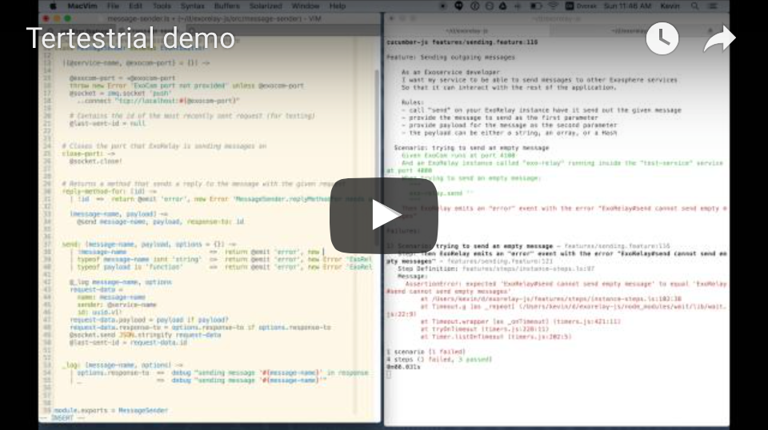

# Tertestrial Server

[](https://circleci.com/gh/Originate/tertestrial-server)
[](https://david-dm.org/Originate/tertestrial-server)
[](https://david-dm.org/Originate/tertestrial-server#info=devDependencies)

_Runs the currently relevant test while coding._

Tertestrial runs configurable tasks on files or parts of files.
Tasks are triggered by hotkeys from within your code editor,
or automatically on file save,
and run in a separate terminal window outside of your editor.
A common application for this is
running a particular unit test that is currently driving your development,
i.e. which you want to make green,
as part of test-driven development.
With Tertestrial you can do this with an absolute minimum of key presses,
distractions, slowdown from unnecessary test runs,
and without having to leave your text editor.

<a href="https://youtu.be/pxrES6xQlxo" target="_blank">
  
</a>

Tertestrial works with all test frameworks
and any text editor with a [Tertestrial plugin](#editor-plugins).
It comes with a set of built-in configurations for common frameworks
that allow you to get started using it right away.


## How it works

Tertestrial consists of a server (in this repository)
and a number of editor plugins.
The editor plugins send commands to the server
via a named pipe `.tertestrial.tmp` in the directory where you start the server
(typically the base directory of the code base you are working on).
Tertestrial removes this pipe when stopping.


## Installation

* install [Node.js](https://nodejs.org/en)

* install the Tertestrial server:

  ```
  npm i -g tertestrial
  ```

* install the [Tertestrial plugin for your editor](#editor-plugins)

* add `.tertestrial.tmp` to your
  [global gitignore](https://help.github.com/articles/ignoring-files/#create-a-global-gitignore).


## Creating a configuration file

To use Tertestrial with a code base,
run `tertestrial --setup` in the root directory of that code base.
This generates a configuration file
that tells Tertestrial
what to do with the different types of files in your project.
The setup script asks whether you want to use one of the built-in configurations
or make your own.


### Built-in configurations

If you select a built-in configuration,
you are done with the setup and can [start using Tertestrial](#running-tertestrial).


### Custom configurations

Editor plugins send simple JSON-encoded messages
that define what the user wants Tertestrial to do.
What keys and values they contain depends on your use case,
and how your editor plugin works.
As an example, here are the messages sent by
[Tertestrial-Vim](https://github.com/originate/tertestrial-vim):

- when the user wants to run the current action on the whole code base

  ```json
  {}
  ```

- when the user wants to run the current action on the given file

  ```json
  {"filename": "foo.js"}
  ```

- when the user wants to run the current action on the given line at the given file:

  ```json
  {"filename": "foo.js", "line": 3}
  ```

- when the user wants to switch to a different set of actions:

  ```json
  {"actionSet": 2}
  ```

Tertestrial's configuration file (tertestrial.yml)
contains data structures with a comparable structure.
They describe the actions to perform
in response to incoming messages.
Actions contain the same fields as messages,
but their values are regular expressions.
The action that most specifically matches an incoming message gets executed
by running the command specified in the action's `command` field.

Below is an example configuration file
for JavaScript developers
who use [Mocha](https://mochajs.org) for unit testing
and [Cucumber-JS](https://github.com/cucumber/cucumber-js) for end-to-end tests:

__tertestrial.yml__
```yml
actions:

  # Here we define what to do with files that have the extension ".feature"
  - filename: '\.feature$'
    command: 'cucumber-js {{filename}}'

  # Here we define how to run just the test at the given line
  # in a file with extension ".feature"
  - filename: '\.feature$'
    line: '\d+'
    command: 'cucumber-js {{filename}}:{{line}}'

  # Here we define what to do with files that have the extension ".js"
  - filename: '\.js$'
    command: 'mocha {{filename}}'
```

The commands to run are specified via
<a href="https://en.wikipedia.org/wiki/Mustache_(template_system)#Examples)">Mustache</a> templates.

When you tell the setup wizard that you want to create your own custom configuration,
it sets up the config file pre-populated with a built-in configuration of your choice
as a starting point for your customizations.


### Multiple action sets

Tertestrial allows to define several sets of actions
and switch between them at runtime.
An example is to have one action set for running tests using a real browser
and another action set to run them using a faster headless browser.

__tertestrial.yml__

```yml
actions:

  - headless:

      - filename: '\.feature$'
        command: 'TEST_PLATFORM=headless cucumber-js {{filename}}'

      - filename: '\.feature$'
        line: '\d+'
        command: 'TEST_PLATFORM=headless cucumber-js {{filename}}:{{line}}'

  - firefox:

      - filename: '\.feature$'
        command: 'TEST_PLATFORM=firefox cucumber-js {{filename}}'

      - filename: '\.feature$'
        line: '\d+'
        command: 'TEST_PLATFORM=firefox cucumber-js {{filename}}:{{line}}'
```

When Tertestrial starts, in activates the first action set.
In this example, it means if you tell it to test a file,
it will do so using the headless browser.
When you switch to the second action set,
it well test files using Firefox as the browser.


### Submitting commonly used configurations

If you have created a good config file
that you think should ship with Tertestrial,
please submit a PR that adds a file with your configuration to
[the "actions" folder](https://github.com/Originate/tertestrial-server/tree/master/actions),
matching the structure of the other files there.


## Running tertestrial

* align your text editor and terminal so that you see both at the same time
  (for example side by side)
* in the terminal, start `tertestrial` in the base directory of your code base
* in the text editor, send some commands using the tertestrial editor plugin
* watch your tests run in your terminal

To end the server, press __ctrl-c__ in the terminal.

__Pro tip:__ if you start tertestrial in the background by running `tertestrial &`,
you can see all test output,
and your terminal remains interactive,
i.e. you can keep running other commands there as well.
Just start typing in the terminal to see your command prompt.
To exit the Tertestrial server in this case,
run `fg` to bring tertestrial back into the foreground,
then press __ctrl-c__.


## Editor plugins

* [Vim](https://github.com/Originate/tertestrial-vim)
* [Emacs](https://github.com/dmh43/emacs-tertestrial)
* [Atom](https://github.com/charlierudolph/tertestrial-atom)


## Create your own editor plugin

Making your own editor plugin is super easy.
All your plugin has to do is be triggered somehow (ideally via hotkeys)
and write the command to execute as a JSON string into the file `.tertestrial.tmp`:

* to test a whole file:

  ```json
  {"operation": "testFile", "filename": "test/foo.rb"}
  ```

* to test just the current line of a file:

  ```json
  {"operation": "testLine", "filename": "test/foo.rb", "line": 12}
  ```

* to repeat the last run test

  ```json
  {"operation": "repeatLastTest"}
  ```

* to switch to a different action set:

  ```json
  {"actionSet": 2}
  ```


## Credits

This software is based on an idea described by Gary Bernhard in his excellent
[Destroy All Software screencasts](https://www.destroyallsoftware.com/screencasts/catalog/running-tests-asynchronously).
If you find this software useful,
subscribe to Gary's talks and presentations
for more of his cool ideas!


## Development

see our [developer documentation](CONTRIBUTING.md).
