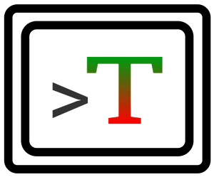

# Tertestrial

Tertestrial is a distributed task execution framework that allows software
developers to run terminal-based automated tests with the absolute smallest
amount of overhead directly from within their development environment.

